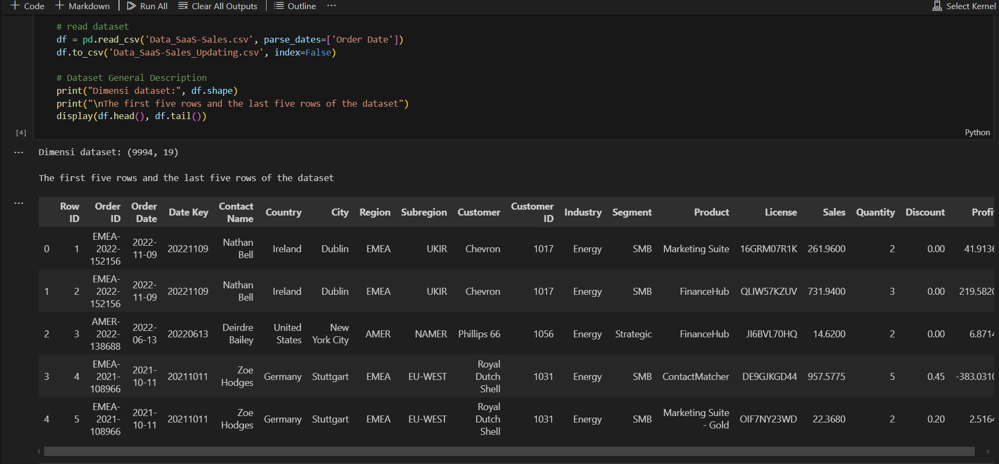
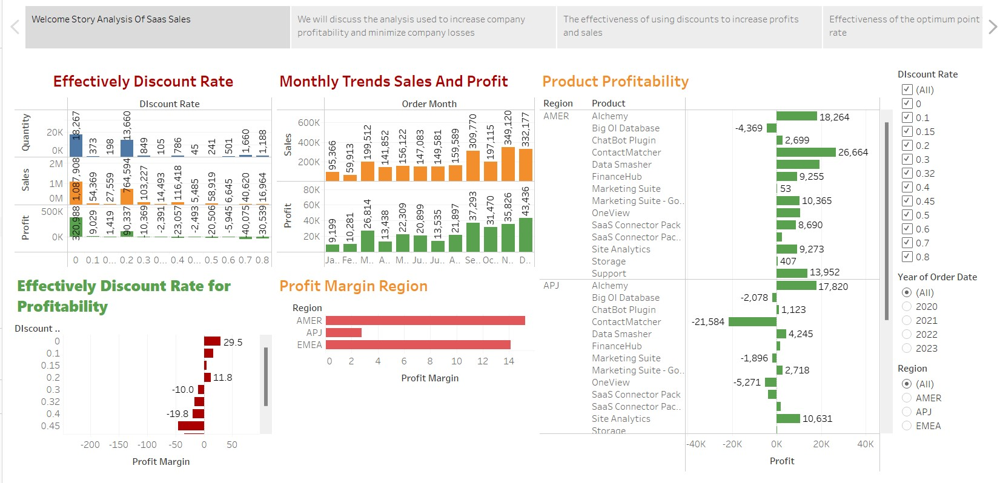

# Capstone Project 2 Purwadhika

SaaS is an abbreviation for Software-as-a-Service. This is a software delivery/sales model in which a third-party provider hosts the application and makes it available to customers over the Internet. Customers can access the application via a browser and pay a monthly subscription for its use. AWS generates revenue from selling software subscriptions to their customers, with most of the applications they sell being sold on a monthly subscription model.

By understanding how discounts affect profitability, knowing sales trends related to product performance, and identifying the contribution of customers and product performance to sales by region, companies can make more appropriate decisions in allocating resources, adjusting marketing strategies, and increasing customer satisfaction overall. 

